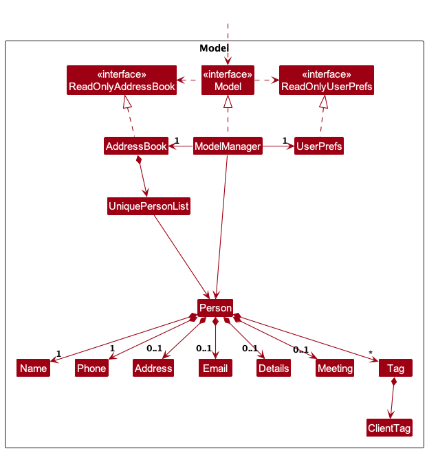
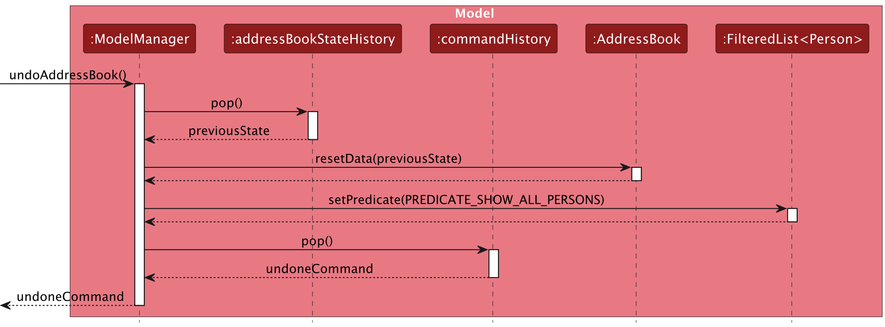
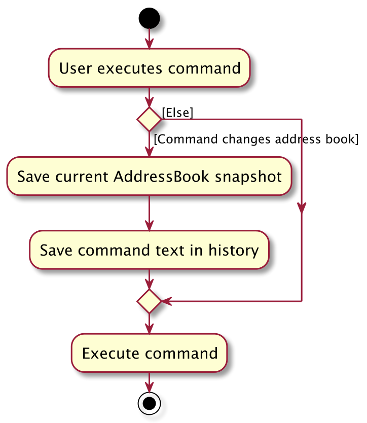
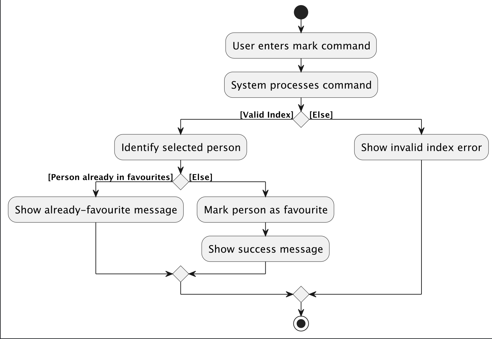
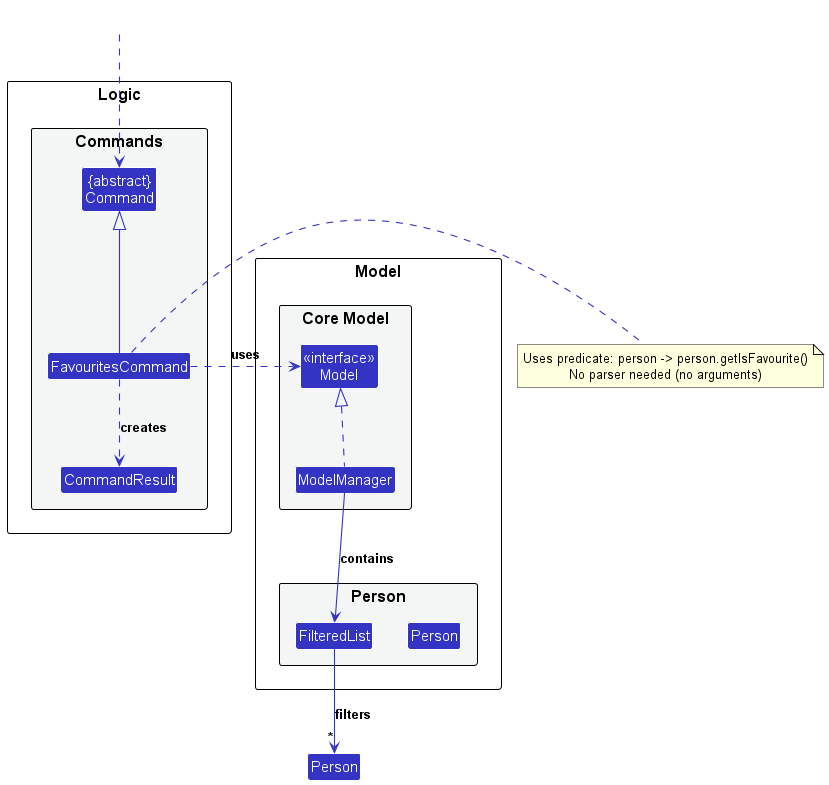
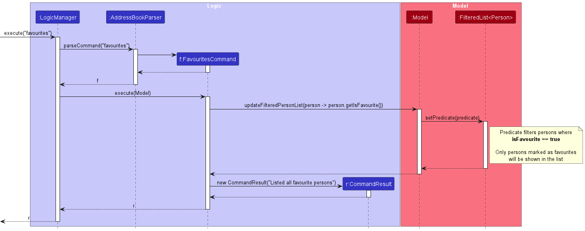
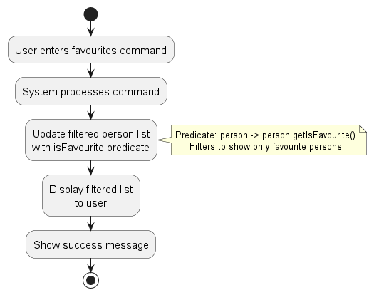

* Table of Contents
{:toc}

--------------------------------------------------------------------------------------------------------------------

## **Acknowledgements**

* Used AI to generate some of the JavaDocs
* Used AI to help with most tests
* Used AI to generate sample data
* Used AI to identify bugs
* Used AI to help improve the Developer Guide, User Guide, and documentation formatting

--------------------------------------------------------------------------------------------------------------------

## **Setting up, getting started**

Refer to the guide [_Setting up and getting started_](SettingUp.md).

--------------------------------------------------------------------------------------------------------------------

## **Design**

:bulb: **Tip:** The `.puml` files used to create diagrams are in this document `docs/diagrams` folder. Refer to the [_PlantUML Tutorial_ at se-edu/guides](https://se-education.org/guides/tutorials/plantUml.html) to learn how to create and edit diagrams.

### Architecture

The ***Architecture Diagram*** given above explains the high-level design of the App.

Given below is a quick overview of main components and how they interact with each other.

**Main components of the architecture**

**`Main`** (consisting of classes [`Main`](https://github.com/AY2526S2-CS2103T-T14-2/tp/tree/master/src/main/java/seedu/address/Main.java) and [`MainApp`](https://github.com/AY2526S2-CS2103T-T14-2/tp/tree/master/src/main/java/seedu/address/MainApp.java)) is in charge of the app launch and shut down.
* At app launch, it initializes the other components in the correct sequence, and connects them up with each other.
* At shut down, it shuts down the other components and invokes cleanup methods where necessary.

The bulk of the app's work is done by the following four components:

* [**`UI`**](#ui-component): The UI of the App.
* [**`Logic`**](#logic-component): The command executor.
* [**`Model`**](#model-component): Holds the data of the App in memory.
* [**`Storage`**](#storage-component): Reads data from, and writes data to, the hard disk.

[**`Commons`**](#common-classes) represents a collection of classes used by multiple other components.

**How the architecture components interact with each other**

The *Sequence Diagram* below shows how the components interact with each other for the scenario where the user issues the command `delete 91234567`.

Each of the four main components (also shown in the diagram above),

* defines its *API* in an `interface` with the same name as the Component.
* implements its functionality using a concrete `{Component Name}Manager` class (which follows the corresponding API `interface` mentioned in the previous point.

For example, the `Logic` component defines its API in the `Logic.java` interface and implements its functionality using the `LogicManager.java` class which follows the `Logic` interface. Other components interact with a given component through its interface rather than the concrete class (reason: to prevent outside component's being coupled to the implementation of a component), as illustrated in the (partial) class diagram below.

The sections below give more details of each component.

### UI component

The **API** of this component is specified in [`Ui.java`](https://github.com/AY2526S2-CS2103T-T14-2/tp/tree/master/src/main/java/seedu/address/ui/Ui.java)

The UI consists of a `MainWindow` that is made up of parts e.g.`CommandBox`, `ResultDisplay`, `PersonListPanel`, `StatusBarFooter` etc. All these, including the `MainWindow`, inherit from the abstract `UiPart` class which captures the commonalities between classes that represent parts of the visible GUI.

The `UI` component uses the JavaFx UI framework. The layout of these UI parts are defined in matching `.fxml` files that are in the `src/main/resources/view` folder. For example, the layout of the [`MainWindow`](https://github.com/AY2526S2-CS2103T-T14-2/tp/tree/master/src/main/java/seedu/address/ui/MainWindow.java) is specified in [`MainWindow.fxml`](https://github.com/AY2526S2-CS2103T-T14-2/tp/tree/master/src/main/resources/view/MainWindow.fxml)

The `UI` component,

* executes user commands using the `Logic` component.
* listens for changes to `Model` data so that the UI can be updated with the modified data.
* keeps a reference to the `Logic` component, because the `UI` relies on the `Logic` to execute commands.
* depends on some classes in the `Model` component, as it displays `Person` object residing in the `Model`.

### Logic component

**API** : [`Logic.java`](https://github.com/AY2526S2-CS2103T-T14-2/tp/tree/master/src/main/java/seedu/address/logic/Logic.java)

Here's a (partial) class diagram of the `Logic` component:

The sequence diagram below illustrates the interactions within the `Logic` component, taking `execute("delete 91234567")` API call as an example.

:information_source: **Note:** The lifeline for `DeleteCommandParser` should end at the destroy marker (X) but due to a limitation of PlantUML, the lifeline continues till the end of diagram.

How the `Logic` component works:

1. When `Logic` is called upon to execute a command, it is passed to an `AddressBookParser` object which in turn creates a parser that matches the command (e.g., `DeleteCommandParser`) and uses it to parse the command.
1. This results in a `Command` object (more precisely, an object of one of its subclasses e.g., `DeleteCommand`) which is handled by the `LogicManager`.
1. For commands that require confirmation, such as `delete` and `clear`, `LogicManager` first returns a confirmation prompt and waits for the user to enter `y` or `n`. Confirmation input is case-insensitive, so `y`, `Y`, `n`, and `N` are accepted.
1. Once confirmed, the command can communicate with the `Model` when it is executed (e.g. to delete a person). 
   Note that although this is shown as a single step in the diagram above (for simplicity), in the code it can take several interactions (between the command object and the `Model`) to achieve.
1. The result of the command execution is encapsulated as a `CommandResult` object which is returned back from `Logic`.

Here are the other classes in `Logic` (omitted from the class diagram above) that are used for parsing a user command:

How the parsing works:
* When called upon to parse a user command, the `AddressBookParser` class creates an `XYZCommandParser` (`XYZ` is a placeholder for the specific command name e.g., `AddCommandParser`) which uses the other classes shown above to parse the user command and create a `XYZCommand` object (e.g., `AddCommand`) which the `AddressBookParser` returns back as a `Command` object.
* All `XYZCommandParser` classes (e.g., `AddCommandParser`, `DeleteCommandParser`, ...) inherit from the `Parser` interface so that they can be treated similarly where possible e.g, during testing.

### Model component
**API** : [`Model.java`](https://github.com/AY2526S2-CS2103T-T14-2/tp/tree/master/src/main/java/seedu/address/model/Model.java)

The `Model` component,

* stores the address book data i.e., all `Person` objects (which are contained in a `UniquePersonList` object).
* stores the currently 'selected' `Person` objects (e.g., results of a search query) as a separate _filtered_ list which is exposed to outsiders as an unmodifiable `ObservableList<Person>` that can be 'observed' e.g. the UI can be bound to this list so that the UI automatically updates when the data in the list change.
* stores a `UserPref` object that represents the user’s preferences. This is exposed to the outside as a `ReadOnlyUserPref` objects.
* stores tags in each `Person` as a `Set<Tag>`, where valid tag values are constrained by the `ClientTag` enum to `RENTER`, `LANDLORD`, `BUYER`, and `SELLER`.
* does not depend on any of the other three components (as the `Model` represents data entities of the domain, they should make sense on their own without depending on other components)

### Storage component

**API** : [`Storage.java`](https://github.com/AY2526S2-CS2103T-T14-2/tp/tree/master/src/main/java/seedu/address/storage/Storage.java)

The `Storage` component,
* can save both address book data and user preference data in JSON format, and read them back into corresponding objects.
* inherits from both `AddressBookStorage` and `UserPrefStorage`, which means it can be treated as either one (if only the functionality of only one is needed).
* depends on some classes in the `Model` component (because the `Storage` component's job is to save/retrieve objects that belong to the `Model`)

### Common classes

Classes used by multiple components are in the `seedu.address.commons` package.

--------------------------------------------------------------------------------------------------------------------

## **Implementation**

This section describes some noteworthy details on how certain features are implemented.

### Undo feature

#### Implementation

The undo mechanism is implemented in `ModelManager` using two stacks:

* `addressBookStateHistory` stores snapshots of earlier `AddressBook` states
* `commandHistory` stores the original command text associated with each saved state

These operations are exposed through the `Model` interface as
`Model#saveAddressBookState(ReadOnlyAddressBook, String)`,
`Model#canUndoAddressBook()`, and `Model#undoAddressBook()`.

Before a command that modifies the address book is executed, `LogicManager` saves the current address book state
together with the command text. Given below is an example usage scenario and how the undo mechanism behaves at each step.

Step 1. The user launches the application for the first time. The undo history is initially empty because no modifying
commands have been executed yet.

Step 2. The user executes `delete 91234567`. After confirmation, `LogicManager` saves the current address book state
using `Model#saveAddressBookState(...)` before the deletion is applied.

Step 3. The user executes `add n/David …​` to add a new person. Before the `add` command modifies the address book,
`LogicManager` saves the current state by calling `Model#saveAddressBookState(...)`.

:information_source: **Note:** If a command fails before completing, no new
address book state is pushed onto the undo history.

Step 4. The user now decides that adding the person was a mistake, and decides to undo that action by executing the
`undo` command. The `undo` command calls `Model#undoAddressBook()`, which restores the most recently saved address book
state.

:information_source: **Note:** If the undo history is empty, there are no
previous address book states to restore. The `undo` command uses `Model#canUndoAddressBook()` to check this before
attempting the undo.

The sequence of interactions for undo is shown below:

Step 5. The user then decides to execute the command `list`. Commands that do not modify the address book do not save
any new state to the undo history.

Step 6. The user executes `clear`. Before the command clears the address book, `LogicManager` again saves the previous
state using `Model#saveAddressBookState(...)`, allowing the clear operation to be undone later.

The command-history flow for a modifying command is summarised below:

#### Design considerations:

**Aspect: How undo executes:**

* **Alternative 1 (current choice):** Saves the entire address book.
  * Pros: Easy to implement.
  * Cons: May have performance issues in terms of memory usage.

* **Alternative 2:** Individual command knows how to undo by itself.
  * Pros: Will use less memory (e.g. for `delete`, just save the person being deleted).
  * Cons: We must ensure that the implementation of each individual command are correct.

### Mark as favourite feature

The `mark` command allows users to mark a person in the currently displayed list as a favourite.
This is implemented by replacing the selected `Person` with an updated copy whose `isFavourite` flag is set to `true`.

#### Implementation

When the user enters a command such as `mark 1`, `LogicManager` passes the input to `AddressBookParser`,
which routes the command to `MarkAsFavouriteCommandParser`.

`MarkAsFavouriteCommandParser#parse(String args)`:

* parses the user input into an `Index` using `ParserUtil#parseIndex(...)`
* constructs and returns a `MarkAsFavouriteCommand` with that index

During execution, `MarkAsFavouriteCommand#execute(Model model)`:

* retrieves the currently filtered person list from the model
* validates that the supplied index refers to an existing displayed person
* retrieves the target `Person` from the filtered list
* checks whether the person is already marked as favourite
* creates a new `Person` object that copies all existing fields and sets `isFavourite` to `true`
* updates the address book through `Model#setPerson(personToEdit, markedPerson)`
* returns a `CommandResult` with a success message

This follows the immutable-update style used by other commands in the codebase. Instead of mutating the existing
`Person` object, the command constructs a replacement `Person` containing the updated favourite status.

The activity flow for `mark` is shown below:

### Meetings feature

The `meeting` command allows users to assign or clear a meeting for a person in the currently displayed list.
Its implementation is split into two main parts:

1. parsing the user-provided date/time string into a valid `Meeting`
2. executing the command to replace the target `Person` with an updated copy containing the new meeting, or no meeting when `clear` is used

#### Implementation

When the user enters a command such as `meeting 1 15 Mar 2026 4pm` or `meeting 1 clear`, `LogicManager` passes the full input to
`AddressBookParser`, which creates a `MeetingCommandParser` for the `meeting` command word.

`MeetingCommandParser#parse(String args)` then:

* separates the target index from the remaining date/time text
* parses the index using `ParserUtil#parseIndex(...)`
* if the remaining input is `clear`, returns a `MeetingCommand` configured to remove the meeting
* otherwise, parses the remaining date/time string using `DateTimeUtil#parseDateTime(...)`
* constructs a `Meeting` from the parsed `LocalDateTime`
* returns a `MeetingCommand` containing the parsed index and meeting

During execution, `MeetingCommand#execute(Model model)`:

* retrieves the currently filtered person list from the model
* validates that the provided index refers to an existing displayed person
* creates a new `Person` object that copies the original person's fields and replaces only the meeting field
* updates the model through `Model#setPerson(personToEdit, updatedPerson)`
* returns a `CommandResult` containing either the meeting-added or meeting-cleared message

The sequence of interactions across the `Logic`, `commons.util`, and `Model` components is split into two diagrams:

* command parsing: [`MeetingCommandParsingSequenceDiagram.puml`](diagrams/MeetingCommandParsingSequenceDiagram.puml)\

* command execution: [`MeetingCommandExecutionSequenceDiagram.puml`](diagrams/MeetingCommandExecutionSequenceDiagram.puml)\

#### Date/time parsing

The parsing logic is centralised in `DateTimeUtil#parseDateTime(String dateTimeStr)`.
This keeps `MeetingCommandParser` focused on command parsing while allowing the same date/time parsing rules to be
reused consistently.

`DateTimeUtil#parseDateTime(...)` works as follows:

* first checks for relative-date inputs such as `today` and `tomorrow`
* then checks weekday inputs such as `monday` or `fri`, which are resolved to the next occurrence of that weekday
* otherwise, iterates through a list of supported `DateTimeFormatter`s to match explicit date formats such as
  `15 Mar 2026 4pm`, `15/3/2026 16:30`, and `15.3.2026 1630`
* if the input contains no time component, defaults the time to `23:59`
* validates that the parsed `LocalDateTime` is not in the past
* returns the parsed result as a `DateTimeParseResult`

For relative dates, `parseRelativeDate(...)` computes the date offset from the current day and optionally parses the
time using `parseTime(...)`. For weekday-based input, `parseWeekday(...)` resolves the next matching day with
`TemporalAdjusters.next(...)` before combining it with either the parsed time or `23:59`.

The control flow of these parsing branches is also split into two smaller diagrams:

* relative-date parsing: [`RelativeMeetingDateParsingActivityDiagram.puml`](diagrams/RelativeMeetingDateParsingActivityDiagram.puml)\

* explicit-format parsing: [`ExplicitMeetingDateParsingActivityDiagram.puml`](diagrams/ExplicitMeetingDateParsingActivityDiagram.puml)\

### Favourites feature

The `favourites` command allows users to filter the contact list to display only persons marked as favourites.

#### Implementation

The `favourites` command filters the contact list to display only persons marked as favourites. Unlike `mark` and `unmark`, this command requires no parser as it takes no arguments.

When a user executes `favourites`, the system:

* Creates a `FavouritesCommand` directly from `AddressBookParser`
* Executes the command, which updates the filtered person list using a predicate: `person -> person.getIsFavourite()`
* Returns a `CommandResult` with the success message

The class structure of the `FavouritesCommand` is shown below:

[`FavouritesCommandClassDiagram.puml`](diagrams/FavouritesCommandClassDiagram.puml)\

The sequence diagram below illustrates the interactions within the `Logic` and `Model` components when executing the `favourites` command:

[`FavouritesCommandSequenceDiagram.puml`](diagrams/FavouritesCommandSequenceDiagram.puml)\

The activity diagram below shows the overall flow of the `favourites` command:

[`FavouritesCommandActivityDiagram.puml`](diagrams/FavouritesCommandActivityDiagram.puml)\

#### Design considerations:

**Aspect: How favourites are stored:**

* **Alternative 1 (current choice):** Store as a boolean field in the `Person` class.
  * Pros: Simple to implement and easy to serialize/deserialize with JSON.
  * Cons: Adds an extra field to every person object even if favourites are rarely used.

* **Alternative 2:** Maintain a separate list of favourite person identifiers.
  * Pros: More memory-efficient if only a few persons are marked as favourites.
  * Cons: More complex implementation requiring synchronization between the person list and favourites list.

--------------------------------------------------------------------------------------------------------------------

## **Documentation, logging, testing, configuration, dev-ops**

* [Documentation guide](Documentation.md)
* [Testing guide](Testing.md)
* [Logging guide](Logging.md)
* [Configuration guide](Configuration.md)
* [DevOps guide](DevOps.md)

--------------------------------------------------------------------------------------------------------------------

## **Appendix: Requirements**

### Product scope

**Target user profile**:

* property agents who manage multiple properties and property-associated contacts
* have a need to manage a significant number of contacts and client interactions
* need to track clients, leads and meetings
* prefer desktop applications over other types of applications
* can type fast and prefer typing over mouse interactions
* are reasonably comfortable using CLI-based applications
* need to quickly search, update, and organize property and contact information
* value efficiency and prefer tools that allow faster data entry and retrieval
* need to manage appointments, property viewings, and follow-ups with clients

**Value proposition**:
Provide a lightweight CLI-based CRM for property agents to efficiently manage client information,
including contacts, property preferences, transaction details, meetings, and interactions.
The application enables agents to quickly organize and retrieve client data from a single place using
fast keyboard-driven commands.

### User stories

Priorities: High (must have) - `* * *`, Medium (nice to have) - `* *`, Low (unlikely to have) - `*`

| Priority | As a …​                   | I want to …​                                                        | So that I can…​                                                    |
|----------|---------------------------|---------------------------------------------------------------------|--------------------------------------------------------------------|
| `* * *`  | user                      | have a list view of client's details like addresses and preferences | easily see only the information I need                             |
| `* * *`  | user                      | be able to sort my contacts by importance/date                      | look at key contacts without scrolling through my full contact list |
| `* * *`  | user                      | delete a person                                                     | remove a client that is no longer working with me                  |
| `* * *`  | user                      | add a person                                                        |                                                                    |
| `* * *`  | user                      | exit app                                                            |                                                                    |
| `* *`    | user with many contacts   | search by details (phone number, address, name etc.)                | locate information of a particular person by that detail           |
| `* *`    | user                      | hide private contact details                                        | minimize chance of someone else seeing them by accident            |
| `* *`    | user                      | edit details                                                        | change client's details instead of deleting their current account  |
| `* *`    | user                      | track my commissions                                                | view which client makes me most money (prioritize  them)           |
| `* *`    | responsible user          | see overdue follow ups with my clients                              | follow up with my overdue follow ups with my clients               |
| `* *`    | efficient and busy user   | configure importance metric (commission or client relation years)   | add existing clients in my phone into the address book             |
| `* *`    | user                      | clear my contacts in bulk                                           | start a new contacts list quickly                                  |
| `* *`    | client centric user       | add interest and hobbies of my clients                              | buy them appreciative gifts before my meeting with them            |
| `* *`    | responsible   user        | set reminders for things regarding the clients                      | keep track of things or events I have with my clients              |
| `* *`    | helpful and friendly user | share my contacts to my colleague                                   | share my client's inforation to my colleague for follow up         |
| `* *`    | responsible user          | document notes about potential clients                              | remember key details for follow-up                                 |
| `* *`    | responsible user          | maintain records of my client's preferences                         | better treat my clients for customer relation                      |
| `* *`    | efficient and busy user   | group my clients in different groups                                | look for a person based on the category or group of people         |
| `*`      | lazy user                 | access past commands                                                | easily repeat my commands with a key                               |
| `*`      | creative user             | change the colour scheme of my address book                         | see better and edit the address book to my liking                  |
| `*`      | clumsy user               | easily backup my contact information                                | restore old client information in case I accidentally lose it      |

### Use cases

(For all use cases below, the **System** is the `CLIentTracker` and the **Actor** is the `user`, unless specified otherwise)

**Use case: Add a person**

**MSS**

1. User requests to add a person with the required details.
2. CLIentTracker adds the person.
3. CLIentTracker shows a confirmation message.

    Use case ends.

**Extensions**

* 1a. The user provides incomplete or invalid details.

  * 1a1. CLIentTracker shows an error message.

    Use case ends.

* 1b. The person already exists in CLIentTracker.

  * 1b1. CLIentTracker shows an error message.

    Use case ends.

**Use case: Delete a person**

**MSS**

1.  User requests to delete a specific person by phone number.
2.  CLIentTracker asks for confirmation.
3.  User confirms the deletion using `y` or `Y`.
4.  CLIentTracker deletes the person.

    Use case ends.

**Extensions**

* 1a. No person matches the given phone number.

  * 1a1. CLIentTracker shows an error message.

    Use case ends.

* 2a. The user cancels the deletion using `n` or `N`.

  * 2a1. CLIentTracker shows a cancellation message.

    Use case ends.

**Use case: Find persons by keyword**

**MSS**

1. User requests to find persons using one or more keywords.
2. User provides general keywords or field-specific keywords.
3. CLIentTracker filters the displayed person list to matching persons.
4. CLIentTracker shows the filtered list.

   Use case ends.

**Extensions**

* 2a. The user provides an invalid search format.

  * 2a1. CLIentTracker shows an error message.

    Use case ends.

* 4a. No persons match the search keyword.

  * 4a1. CLIentTracker shows an empty list.

    Use case ends.

**Use case: Edit a person's details**

**MSS**

1. User views a displayed list of persons.
2. User requests to edit a specific person in the displayed list.
3. User provides the updated detail(s).
4. CLIentTracker updates the person’s details.
5. CLIentTracker shows a confirmation message.

    Use case ends.

**Extensions**

* 1a. The displayed list is empty.

    Use case ends.

* 2a. The given index is invalid.

  * 2a1. CLIentTracker shows an error message.

    Use case resumes at step 1.

* 3a. The user provides invalid detail(s).

  * 3a1. CLIentTracker shows an error message.

    Use case resumes at step 3.

**Use case: Clear all contacts**

**MSS**

1. User requests to clear all contacts.
2. CLIentTracker asks for confirmation.
3. User confirms the clear command using `y` or `Y`.
4. CLIentTracker clears all contacts.
5. CLIentTracker shows a confirmation message.

   Use case ends.

**Extensions**

* 2a. The user cancels the clear command using `n` or `N`.

  * 2a1. CLIentTracker shows a cancellation message.

    Use case ends.

**Use case: Mark a person as favourite**

**MSS**

1. User views a displayed list of persons.
2. User requests to mark a specific person in the displayed list as favourite.
3. CLIentTracker marks the person as favourite.
4. CLIentTracker shows a confirmation message.

   Use case ends.

**Extensions**

* 1a. The displayed list is empty.

    Use case ends.

* 2a. The given index is invalid.

  * 2a1. CLIentTracker shows an error message.
  * 2a1. CLIentTracker shows an error message.

    Use case resumes at step 1.

* 2b. The selected person is already marked as favourite.

  * 2b1. CLIentTracker shows an error message.

    Use case ends.

**Use case: Unmark a person as favourite**

**MSS**

1. User views a displayed list of persons.
2. User requests to remove the favourite status of a specific person in the displayed list.
3. CLIentTracker removes the person's favourite status.
4. CLIentTracker shows a confirmation message.

   Use case ends.

**Extensions**

* 1a. The displayed list is empty.

    Use case ends.

* 2a. The given index is invalid.

  * 2a1. CLIentTracker shows an error message.

    Use case resumes at step 1.

* 2b. The selected person is not marked as favourite.

  * 2b1. CLIentTracker shows an error message.

    Use case ends.

**Use case: View favourite persons**

**MSS**

1. User requests to view favourite persons.
2. CLIentTracker filters the displayed list to persons marked as favourite.
3. CLIentTracker shows the filtered list.

   Use case ends.

**Use case: Add or clear a meeting**

**MSS**

1. User views a displayed list of persons.
2. User requests to add a meeting to a specific person in the displayed list, or clear an existing meeting.
3. CLIentTracker updates the person's meeting information.
4. CLIentTracker shows a confirmation message.

   Use case ends.

**Extensions**

* 1a. The displayed list is empty.

    Use case ends.

* 2a. The given index is invalid.

  * 2a1. CLIentTracker shows an error message.

    Use case resumes at step 1.

* 2b. The user provides an invalid or past date/time.

  * 2b1. CLIentTracker shows an error message.

    Use case ends.

**Use case: Undo the last modifying command**

**MSS**

1. User requests to undo the most recent modifying command.
2. CLIentTracker restores the previous address book state.
3. CLIentTracker shows a confirmation message.

   Use case ends.

**Extensions**

* 1a. There is no previous modifying command to undo.

  * 1a1. CLIentTracker shows an error message.

    Use case ends.

### Non-Functional Requirements

1.  Should work on any _mainstream OS_ as long as it has Java `17` or above installed.
2.  Should be able to hold up to 1000 persons without a noticeable sluggishness in performance for typical usage.
3.  A user with above average typing speed for regular English text (i.e. not code, not system admin commands) should be able to accomplish most of the tasks faster using commands than using the mouse.
4. The application should _respond to user commands_ within 1 second for typical operations (e.g., add, delete, edit, list, search) under normal load
5. The system should _persist all data_ locally so that client information is retained after the application is closed and reopened
6. The application should _gracefully handle invalid inputs_ by displaying clear error messages without crashing
7. The system should _maintain data_ integrity, ensuring that duplicate contacts or invalid fields are prevented according to validation rules
8. The application should _automatically_ save changes to storage after any command that modifies the data
9. The application should maintain _readability and maintainability of code_, following standard Java coding conventions and modular architecture
10. The system should be designed so that _new commands or features can be added with minimal modification to existing components_

### Glossary

* **Mainstream OS**: Windows, Linux, Unix, MacOS
* **Private contact detail**: A contact detail that is not meant to be shared with others
* **Client** A person whose contact information and interaction details are managed by the application
* **Contact** The stored record containing a client’s information such as name, phone number, email, address, and other relevant details
* **Filtered List** A subset of contacts displayed after applying search or filter commands.
* **Command** A text instruction entered by the user to perform an operation in the system (e.g., add, delete, edit, list).
* **Persistence** The capability of the application to save data to storage so it remains available across application restarts.
* **Index** The number assigned to a contact in the displayed list, used to identify that contact when performing commands like delete or edit.

--------------------------------------------------------------------------------------------------------------------

## **Appendix: Instructions for manual testing**

Given below are instructions to test the app manually.

:information_source: **Note:** These instructions only provide a starting point for testers to work on;
testers are expected to do more *exploratory* testing.

### Launch and shutdown

1. Initial launch

   1. Download the jar file and copy it into an empty folder.

   1. Double-click the jar file. 
      Expected: The GUI opens with a set of sample contacts loaded. The initial window size may not be optimum.

1. Saving window preferences

   1. Resize the window to an optimum size. Move the window to a different location. Close the window.

   1. Re-launch the app by double-clicking the jar file. 
       Expected: The most recent window size and location is retained.

### Adding a person

1. Adding a new person

   1. Prerequisites: Start with the sample data loaded.

   1. Test case:
      `add n/Test Person p/81234567 e/test@example.com a/Test Street 1 d/Interested in condo t/Buyer` 
      Expected: A new contact is added to the list with the supplied fields. Success message is shown.

   1. Test case:
      `add n/Test Person p/81234567` 
      Expected: No person is added because the phone number already exists. An error message is shown.

   1. Test case:
      `add n/Test Person p/81234abc` 
      Expected: No person is added. An error message describing invalid command input is shown.

### Deleting a person

1. Deleting a person by phone number

   1. Prerequisites: Ensure a contact with phone number `81234567` exists. If not, add one using
      `add n/Delete Me p/81234567`.

   1. Test case: `delete 81234567`, followed by `y` or `Y` 
      Expected: The contact is deleted. A success message is shown and the person disappears from the displayed list.

   1. Test case: `delete 81234567`, followed by `n` or `N` 
      Expected: The deletion is cancelled. The contact list remains unchanged.

   1. Test case: `delete 00000000` 
      Expected: No person is deleted. An error message is shown.

   1. Other incorrect delete commands to try: `delete`, `delete abc` 
      Expected: No person is deleted. An error message is shown.

### Clearing all entries

1. Clearing the address book

   1. Prerequisites: The list contains at least one person.

   1. Test case: `clear`, followed by `n` or `N` 
      Expected: The clear operation is cancelled. The contact list remains unchanged.

   1. Test case: `clear`, followed by `y` or `Y` 
      Expected: All contacts are removed from the list. A success message is shown.

### Marking and unmarking favourites

1. Marking a contact as favourite

   1. Prerequisites: Use `list` to show all persons. Choose a displayed person that is not already marked as favourite.

   1. Test case: `mark 1` 
      Expected: The first displayed contact is marked as favourite. A success message is shown.

   1. Test case: `mark 1` again on the same contact 
      Expected: No change is made. An error message indicates that the person is already in favourites.

   1. Test case: `mark 0` 
      Expected: No change is made. An error message is shown.

1. Unmarking a contact as favourite

   1. Prerequisites: Ensure the first displayed contact is already marked as favourite.

   1. Test case: `unmark 1` 
      Expected: The first displayed contact is removed from favourites. A success message is shown.

   1. Test case: `unmark 1` again on the same contact 
      Expected: No change is made. An error message indicates that the person is not marked as favourite.

1. Viewing favourites only

   1. Prerequisites: At least one contact is marked as favourite.

   1. Test case: `favourites` 
      Expected: Only contacts currently marked as favourite are displayed.

### Adding and clearing meetings

1. Adding a meeting

   1. Prerequisites: Use `list` to show all persons.

   1. Test case: `meeting 1 15 Mar 2030 4pm` 
      Expected: A meeting is added to the first displayed contact. A success message is shown.

   1. Test case: `meeting 1 tomorrow 9am` 
      Expected: A meeting is added using the parsed relative date and time. A success message is shown.

   1. Test case: `meeting 1 1 Jan 2020 4pm` 
      Expected: No meeting is added because the date/time is in the past. An error message is shown.

   1. Test case: `meeting 0 15 Mar 2030 4pm` 
      Expected: No meeting is added. An error message is shown.

1. Clearing a meeting

   1. Prerequisites: The first displayed contact already has a meeting assigned.

   1. Test case: `meeting 1 clear` 
      Expected: The meeting is removed from the first displayed contact. A success message is shown.

### Undoing previous changes

1. Undo after a modifying command

   1. Prerequisites: There is at least one contact in the list.

   1. Test case: `mark 1`, then `undo` 
      Expected: The favourite change is reverted and the contact returns to its previous state.

   1. Test case: `meeting 1 15 Mar 2030 4pm`, then `undo` 
      Expected: The meeting addition is reverted.

   1. Test case: `clear`, followed by `y`, then `undo` 
      Expected: The previously cleared contact list is restored.

   1. Test case: launch the app and immediately run `undo` 
      Expected: No change is made. An error message indicates that there are no commands to undo.

### Saving data

1. Dealing with missing/corrupted data files

   1. Close the application.

   1. Open the data file at `data/addressbook.json` and make a backup copy.

   1. Delete `data/addressbook.json`, then relaunch the application. 
      Expected: The application starts successfully and recreates the data file.

   1. Edit `data/addressbook.json` and replace part of the file with invalid JSON such as removing a closing brace,
      then relaunch the application. 
      Expected: The application starts with an empty address book and creates a fresh valid data file.

   1. Restore the backup copy after testing.

--------------------------------------------------------------------------------------------------------------------

## **Appendix: Planned Enhancements**

Team size: 5

1. Allow contact deletion by displayed index: The current `delete` command only deletes a contact by full phone number, e.g. `delete 91234567`. We plan to also allow deletion by the displayed list index, e.g. `delete 1`, so users can delete a contact directly after using commands such as `list`, `find`, or `favourites` without copying the phone number.

1. Allow multiple meetings per contact: The current `meeting` command stores only one meeting per contact, so adding a new meeting replaces the existing meeting. We plan to allow each contact to store multiple meetings, e.g. `meeting 1 15 Mar 2030 4pm` followed by `meeting 1 20 Mar 2030 2pm` would keep both meetings for the first displayed contact instead of replacing the first one.

1. Allow phone numbers from other countries: The current phone number validation only accepts local Singapore phone numbers. We plan to allow phone numbers with country codes, e.g. `+60 123456789` or `+1 2125551234`, so users can store contacts from other countries without removing the country code.
