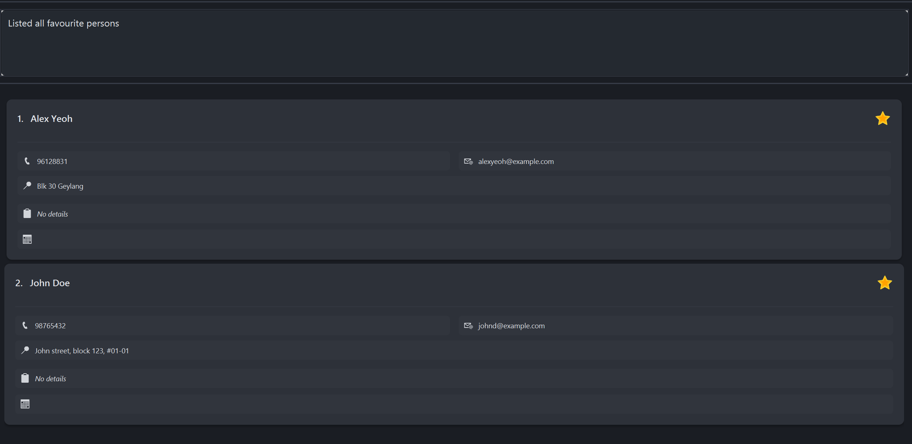

CLIentTracker is a desktop Customer Relationship Management (CRM) designed for property agents, optimized for use via a Command Line Interface (CLI) while
retaining a clean and simple visual interface. It enables efficient management of clients, property listings, notes, and
meetings through commands such as add, edit, find, and list, allowing users to update and retrieve information faster
than traditional GUI-based systems. For agents who are comfortable with typing, this significantly improves productivity
in day-to-day operations.

Unlike many web-based CRMs, CLIentTracker works fully offline, making it reliable in environments with poor or unstable
connectivity, such as property viewings or on-site visits. Core actions like searching, editing, or scheduling meetings
are performed instantly, without delays from loading or syncing. All data is automatically saved when the application
closes, ensuring records remain secure without manual intervention.

Built for agents who value speed, reliability, and control, CLIentTracker helps users focus on clients rather than tools
in fast-paced environments.

## :page_facing_up: Contents
- [:rocket: Quick Start](#quick-start)
- [:clipboard: Command Summary](#command-summary)
- [:gear: Features](#features)
- [:question: FAQ](#faq)
- [:warning: Known Issues](#known-issues)

---
## :rocket: Quick Start
{: #quick-start }

CLIentTracker is a desktop CRM designed for property agents who prefer working quickly from the command line while
still having a clean desktop interface.

### Installation

1. Ensure you have Java `17` or above installed on your computer. 
   **Mac users:** Ensure you have the precise JDK version prescribed [here](https://se-education.org/guides/tutorials/javaInstallationMac.html).

1. Download the latest `.jar` file from [here](https://github.com/AY2526S2-CS2103T-T14-2/tp/releases/).

1. Copy the file to the folder you want to use as the _home folder_ for your CLIentTracker.

1. Open the folder where your CLIentTracker is currently located, double click to run CLIentTracker and a User Interface similar to the one below should appear in a few seconds with some sample data loaded. 
   

### Try It Out

1. Type commands into the command box and press Enter to execute them.

1. Try these example commands:

   * `list` to list all contacts
   * `add n/John Doe p/98765432 e/johnd@example.com a/John street, block 123, #01-01` to add a contact
   * `delete 87438807` to delete the contact with the phone number `87438807` (`y` to confirm deletion)
   * `clear` to delete all contacts (`y` to confirm clear)
   * `find n/John` to search for contacts by name
   * `exit` to close the application

1. Continue with the sections below for full command details, or jump straight to the [Command Summary](#command-summary).

Want to start fresh? Use `clear` and confirm with `y` to remove the sample contacts and begin with an empty contact list.

---
## :clipboard: Command Summary
{: #command-summary }

**:information_source: Notes about the command format:** 

* Words in `UPPER_CASE` are the parameters to be supplied by the user. 
  * e.g. in `add n/NAME`, `NAME` is a parameter which can be used as `add n/John Doe`.

  * Items in square brackets are optional. 
    * e.g `n/NAME [t/TAG]` can be used as `n/John Doe t/Buyer` or as `n/John Doe`.

  * Items with `…`​ after them can be used multiple times including zero times. 
    * e.g. `[t/TAG]…​` can be used as ` ` (i.e. 0 times), `t/Buyer`, `t/Landlord` etc.

  * Parameters can be in any order. 
    *  e.g. if the command specifies `n/NAME p/PHONE_NUMBER`, `p/PHONE_NUMBER n/NAME` is also acceptable.

  * Extraneous parameters for `help`, `list`, `exit`, `favourites`, and `undo` will be ignored. 
    * e.g. if the command specifies `help 123`, it will be interpreted as `help`.
  * `clear` does not accept trailing arguments. 
    * e.g. `clear` and `clear   ` are accepted, but `clear 123` is invalid.
  * `TAG` is not case-sensitive. Valid tags: ("Renter", "Landlord", "Buyer", "Seller").

  * If you are using a PDF version of this document, be careful when copying and pasting commands that span multiple lines as space characters surrounding line-breaks may be omitted when copied over to the application.

Action | Description                                                       | Format, Examples
--------|-------------------------------------------------------------------|------------------
**Add** | [Adds a new person](#adding-a-person-add)                         | `add n/NAME p/PHONE_NUMBER [e/EMAIL] [a/ADDRESS] [d/DETAILS] [t/TAG]…​`   e.g., `add n/James Ho p/22224444 e/jamesho@example.com a/123, Clementi Rd, 1234665 d/Looking to buy in north t/BUYER`
**Edit** | [Edits an existing person](#editing-a-person-edit)                | `edit INDEX [n/NAME] [p/PHONE_NUMBER] [e/EMAIL] [a/ADDRESS] [d/DETAILS] [t/TAG]…​`  e.g.,`edit 2 n/James Lee e/jameslee@example.com d/Updated work details`
**Find** | [Finds persons by name or phone](#locating-persons-find)          | `find KEYWORD [MORE_KEYWORDS]` for name search  `find p/PHONE_NUMBER` for phone search  e.g., `find James Jake` or `find p/98765432`
**Delete** | [Deletes a person](#deleting-a-person--delete)                    | `delete PHONE`  e.g., `delete 91234567`
**Clear** | [Clears all entries](#clearing-all-entries--clear)                | `clear`
**Mark** | [Adds contact into favourites](#favourites-mark-and-unmark)       | `mark INDEX`   e.g., `mark 1`
**Unmark** | [Removes contact from favourites](#favourites-mark-and-unmark)    | `unmark INDEX`   e.g., `unmark 1`
**Meeting** | [Adds or clears a meeting for a contact](#adding-a-meeting-meeting) | `meeting INDEX DATE_TIME` or `meeting INDEX clear`   e.g., `meeting 1 mon 2pm`
**Undo** | [Undo previous changes](#Undo-previous-changes-undo)              | `undo`
**List** | [Lists all persons](#listing-all-persons-list)                    | `list`
**Favourites** | [View favourites](#Viewing-favourites-favourites)                 | `favourites`
**Help** | [Shows help message](#viewing-help-help)                          | `help`
**Exit** | [Exits the app](#exiting-the-program-exit)                        | `exit`

---
## :gear: Features
{: #features }

### Adding a person: `add`

Adds a new contact

Format: `add n/NAME p/PHONE_NUMBER [e/EMAIL] [a/ADDRESS] [d/DETAILS] [t/TAG]…​`

Parameters:
* `p/` : Phone number of the new contact (*Unique identifier; must contain only digits and be 8-15 digits long*)
  * **Note:** For international numbers with country codes, omit the plus (+) and any spaces. For example, use `6512345678` instead of `+65 1234 5678`.
* `n/` : Name of the new contact (*Must be 1-50 characters*)
* `e/` : Email of the new contact [optional]
  - Must follow the [Email rules](#email-rules)
* `a/` : Address of the new contact [optional] (*Must be 1-255 characters, or empty to represent no address*)
* `d/` : Details of the new contact [optional] (*Must be under 512 characters, or empty to represent no details*)
* `t/` : Tags of the new contact [optional] (*Valid tags: "Renter", "Landlord", "Buyer", "Seller"*)

:bulb: **Tip:**
A person can have any number of tags (including 0)

Behavior:
* If a contact with the same phone number already exists, the new contact will not be added.
* Phone numbers must contain only digits and be 8-15 digits long.
* Name must be 1-50 characters and contain only alphanumeric characters and spaces.
* Details will default to empty if parameter not used.
* Details must not be over 512 characters and cannot be empty.
* Address will default to empty if parameter not used.
* Address must be 1-255 characters if provided, or empty to represent no address.

Examples:
* `add n/John Doe p/98765432 e/johnd@example.com a/John street, block 123, #01-01`
* `add n/Betsy Crowe a/Newgate Prison p/12345678 t/BUYER`
* `add n/Alex Yeoh p/87438807 e/alexyeoh@example.com a/Blk 30 Geylang Street 29, #06-40 d/Looking for apartment near city`

---

### Editing a person: `edit`

Edits an existing person in CLIentTracker.

Format: `edit INDEX [n/NAME] [p/PHONE] [e/EMAIL] [a/ADDRESS] [d/DETAILS] [t/TAG]…​`

Parameters:
* `INDEX` : The index of the person to edit. The index refers to the index number shown in the displayed person list. The index **must be a positive integer** 1, 2, 3, …​
* `p/` : Phone number of the new contact (*Unique identifier; must contain only digits and be 8-15 digits long*)
  * **Note:** For international numbers with country codes, omit the plus (+) and any spaces. For example, use `6512345678` instead of `+65 1234 5678`.
* `n/` : Name of the new contact (*Must be 1-50 characters*)
* `e/` : Email of the contact [optional]
  - Must follow the [Email rules](#email-rules)
* `a/` : Address of the new contact [optional] (*Must be 1-255 characters, or empty to represent no address*)
* `d/` : Details of the new contact [optional] (*Must be under 512 characters, or empty to represent no details*)
* `t/` : Tags of the new contact [optional] (*Valid tags: "Renter", "Landlord", "Buyer", "Seller"*)

Behavior:
* The index field is mandatory and **must be a positive integer smaller than the number of contacts**.
* At least one of the fields must be provided.
* Existing values will be updated to the input values.
* Phone numbers must contain only digits and be 8-15 digits long.
* When editing tags, the existing tags of the person will be removed i.e adding of tags is not cumulative.
* You can remove all the person’s tags by typing `t/` without specifying any tags after it.
* Editing details replaces existing ones (not cumulative).
* Use `d/`, `e/`, or `a/` with no value to clear details, email, or address respectively.
* Contacts with duplicate phone numbers will not be updated.

Examples:
*  `edit 1 p/91234567 e/johndoe@example.com` Edits the phone number and email address of the 1st person to be `91234567` and `johndoe@example.com` respectively.
*  `edit 2 n/Betsy Crower t/` Edits the name of the 2nd person to be `Betsy Crower` and clears all existing tags.
*  `edit 3 d/` Clears the details of the 3rd person.
*  `edit 4 e/` Clears the email of the 4th person.
*  `edit 5 a/` Clears the address of the 5th person.

#### **Important Notes:**
- If you want to change a specific field, **remember to have a white space before the prefix**
  - ❌ `edit 1 a/yishunp/12345678`
  - ✅ `edit 1 a/yishun p/12345678`
  - ✅ `edit 1 d/want Sentosa/Yishun`

---

### Locating persons: `find`

Search for persons using keywords across all fields or within specific fields.

#### **Format:**
- General search:  
  `find KEYWORD[, KEYWORD]...`

- Field-specific search:  
  `find PREFIX/KEYWORD[, KEYWORD] PREFIX/KEYWORD[, KEYWORD]...`

**Prefixes:**
- `n/` — name
- `p/` — phone
- `a/` — address
- `e/` — email
- `d/` — details
- `t/` — tags

#### **General Search:**
- Searches across **name, phone, address, email, and details**
- ❗ Does **not** search through tags
- Case-insensitive (`alex` = `Alex`)
- Supports partial matches (`lex` → `Alex`)
- Keywords are **comma-separated**
- If no commas are used, the entire input is treated as a **single keyword**
- Matches if **any keyword** is found (**OR** logic)

**Examples:**
- `find alex`
- `find alex, bob`
- `find alex bob` *(searches for "alex bob" as one phrase)*
- `find 9876`

#### **Field-Specific Search:**
- Searches only within specified field(s)
- Case-insensitive and supports partial matches
- Keywords must be **comma-separated**

**Examples:**
- `find n/Alex`
- `find p/9876`
- `find t/buyer`
- `find n/Alex, Bob p/9123`
- `find t/buyer, seller`

#### **Rules:**
- Keywords within the same prefix use **OR**
    - `find n/Alex, Bob` → name contains *Alex* or *Bob*

- Different prefixes use **AND**
    - `find n/Alex p/9123` → name contains *Alex* AND phone contains *9123*

> 💡 More Prefix rules:
>- Prefixes are **case-sensitive** and must be in lowercase
  >  - ❌ `N/Alex` is invalid
  >  - ✅ `n/Alex` is valid
>
> - Prefixes must be **preceded by a space**
  >   - ⚠️ `find n/Alexp/1234`, otherwise **assumed** to be a keyword
  >   - ✅ `find n/Alex p/1234`
>
> - If prefixes are **not properly separated**, they are treated as part of the same field
  >   - `find n/Alexp/1234` is interpreted as searching for the name `"Alexp/1234"`

### **⚠️Important Notes:**
- You **cannot mix general search and prefix search**
  - ❌ `find alex p/9876`

- Commas are required if you want to separate multiple keywords, otherwise it's ok
  - ⚠️ `find n/Alex Bob`, this is **okay** if searching for "Alex Bob"
  - ✅ `find n/Alex, Bob`

- To search by tags, you must use the `t/` prefix
  - ⚠️ `find buyer`, this is **okay** if searching for "buyer" not in tag
  - ✅ `find t/buyer`

- Keywords must contain at least one letter or number
  - ❌ `find !!!`
  - ❌ `find n/@@@`
  - ✅ `find alex123`
  - ✅ `find #02-25`

---

### Adding a meeting: `meeting`
Adds or clears a meeting for a client identified by the displayed index number.

Format: `meeting INDEX DATE_TIME` or `meeting INDEX clear`

* The **INDEX** refers to the index number shown in the displayed person list.
* Use `clear` to remove an existing meeting from the selected client.
* The **DATE_TIME** can be entered in various flexible formats:

**Relative Date formats:**
- `Today` - today's date
- `Tomorrow` - tomorrow's date
- `Monday`/`Mon` - next Monday
- `Tuesday`/`Tue` - next Tuesday
- `Wednesday`/`Wed` - next Wednesday
- `Thursday`/`Thu` - next Thursday
- `Friday`/`Fri` - next Friday
- `Saturday`/`Sat` - next Saturday
- `Sunday`/`Sun` - next Sunday

**Static Date formats:**
- `15 Mar` (day month)
- `15 Mar 2030` (day month year)
- `15 March` (full month name)
- `15 March 2030` (full month name)
- `15/3/2030` (slash separators)
- `15-3-2030` (dash separators)
- `15.3.2030` (dot separators)

**Time formats (Must be combined with date):**
- `4pm` (12-hour format)
- `4:30pm` (12-hour with minutes)
- `4.30pm` (12-hour with dot minutes)
- `1600` (24-hour format)
- `14:30` (24-hour with colon)

**Combined examples:**
- `meeting 1 15 Mar 2030 4pm`
- `meeting 2 15 March 2030 4:30pm`
- `meeting 3 15/3/2030 1600`
- `meeting 4 15-3-2030 14:30`
- `meeting 5 15.3.2030 1630`
- `meeting 6 today 4pm` (today at 4 PM)
- `meeting 7 tomorrow 9am` (tomorrow at 9 AM)
- `meeting 8 monday 2pm` (next Monday at 2 PM)
- `meeting 9 fri 1600` (next Friday at 4 PM)
- `meeting 1 clear` (clears the meeting for the 1st person)

### ⚠️ Important Notes
- Meeting dates and times must be in the future
- If no time is specified, defaults to 11:59 PM (`23:59`)
- All date/time inputs are case-insensitive
- When using (day month) format, avoid using (24-hour format)
  - `20 april 2359` will result in year 2359; Instead use `20 april 11:59`

---

### Deleting a person : `delete`

Deletes the specified person from CLIentTracker.

Format: `delete PHONE`

* Deletes the person with `PHONE`.
  * The PHONE refers to the index number shown in the displayed person list.
  * The PHONE **must match fully** ​
  * Confirm with `y`/`n` after the delete command is entered. Confirmation input is case-insensitive, so `y`, `Y`, `n`, and `N` are accepted.

Examples:
* `delete 91234567` deletes the person with said phone number in CLIentTracker.
* `delete 912` is invalid and will throw a error message

---

### Clearing all entries : `clear`

Deletes all entries from CLIentTracker, including favourites. 
* Confirm with `y`/`n` after the clear command is entered. Confirmation input is case-insensitive, so `y`, `Y`, `n`, and `N` are accepted.
* `clear` only works without trailing arguments. `clear` and `clear   ` are accepted, but `clear 123` is invalid.

Format: `clear`

---

### Favourites: `mark` and `unmark`

Add or remove contacts from favourites

Format: `mark INDEX` or `unmark INDEX`
* Mark `INDEX` adds the contact at the specified index to favourites.
* Unmark `INDEX` removes the contact at INDEX from favourites
* `INDEX` refers to the index number shown on the displayed person list
* `INDEX` must be a valid number in the list

Examples:
* `mark 1`   

---

### Undo previous changes: `undo`
{: #undo }

Reverts the most recent change made to CLIentTracker contacts.

Format: `undo`

* Restores the contact list to its previous state before the last modifying command
* If there are no previous changes to undo in the current session, an error message is shown
* `undo` works with or without trailing arguments. Any trailing arguments are ignored.
### ⚠️ Important Notes
  * Undo will reset any active filters applied on the list.

---

### Listing all persons: `list`

Shows a list of all persons in CLIentTracker.

Format: `list`

* `list` works with or without trailing arguments. Any trailing arguments are ignored.

---

### Viewing favourites: `favourites`

Displays a list containing only contacts marked as favourites. Favourite contacts are those previously flagged by the user using the `mark` command

Format: `favourites`

* `favourites` works with or without trailing arguments. Any trailing arguments are ignored.

---

### Viewing help: `help`

Shows a message explaining how to access the help page
The user can open their preferred browser and paste the provided URL to access it
They can also manually close the help window by clicking the close button or pressing the Escape key.

Format: `help`

* `help` works with or without trailing arguments. Any trailing arguments are ignored.

---

### Exiting the program: `exit`

Exits the program.

Format: `exit`

* `exit` works with or without trailing arguments. Any trailing arguments are ignored.

---

### :floppy_disk: Data Storage & Saving

CLIentTracker is designed to be **fast and worry-free** — your data is automatically saved after every command.

There is **no need to press a save button**. Everything is stored locally on your device, allowing you to:
- Work completely offline
  - Access your data instantly
  - Avoid losing changes due to unsaved progress

All data is stored in:

`[CLIentTracker file location]/data/addressbook.json`

CLIentTracker is intended for **medium to moderately large contact lists**. Performance may degrade for very large
datasets, especially above **50,000 to 100,000 contacts**, depending on your device's memory and CPU.

---

### :pencil2: Editing the data file

CLIentTracker data are saved automatically as a JSON file `[CLIentTracker file location]/data/addressbook.json`. Advanced users are welcome to update data directly by editing that data file.

:exclamation: **Caution:**
If your changes to the data file makes its format invalid, CLIentTracker will discard all data and start with an empty data file at the next run. Hence, it is recommended to take a backup of the file before editing it. 
Furthermore, certain edits can cause CLIentTracker to behave in unexpected ways (e.g., if a value entered is outside of the acceptable range). Therefore, edit the data file only if you are confident that you can update it correctly.

---

### Email Rules 

Emails must follow the format `local-part@domain`.

### Format rules
- The local-part:
  - May contain alphanumeric characters and `+ - . _`
  - Parentheses (`(` and `)`) are not allowed
  - Must not start or end with a special character
- The `@` symbol separates the local-part and the domain

### Domain rules
- The domain consists of labels separated by periods (`.`)
- Each label:
  - Is at least 2 characters long
  - Starts and ends with an alphanumeric character
  - May contain hyphens (`-`) in between

### Length and optionality
- Email length must be between **1 and 254 characters**
- If the email parameter is omitted or left empty (`e/`), the contact will have **no email**

---

## :question: FAQ
{: #faq }

**Q**: How do I transfer my data to another Computer? 
**A**: Install the app on the other computer and overwrite the empty data file it creates with the file that contains the data from your previous CLIentTracker home folder.

---

## :warning: Known Issues
{: #known-issues }

1. **When using multiple screens**, if you move the application to a secondary screen, and later switch to using only the primary screen, the GUI will open off-screen. The remedy is to delete the `preferences.json` file created by the application before running the application again.
2. **If you minimize the Help Window** and then run the `help` command (or use the `Help` menu, or the keyboard shortcut `F1`) again, the original Help Window will remain minimized, and no new Help Window will appear. The remedy is to manually restore the minimized Help Window.

---
