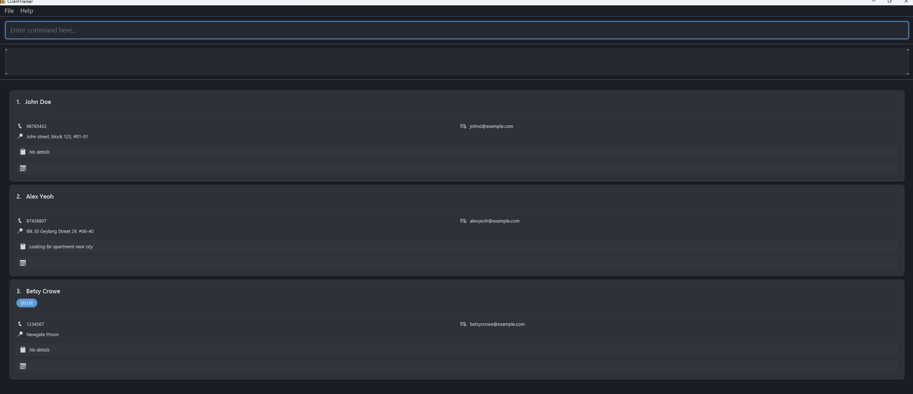
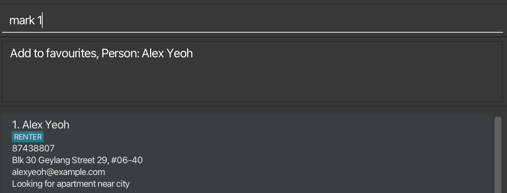
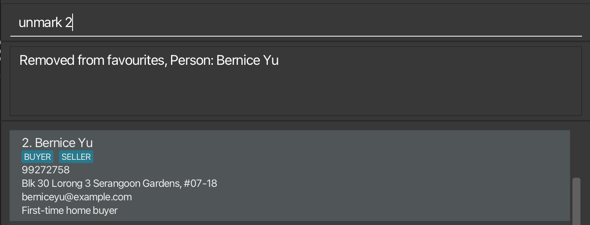

CLIentTracker is a desktop CRM designed for property agents, optimized for use via a Command Line Interface (CLI) while
retaining a clean and simple visual interface. It enables efficient management of clients, property listings, notes, and
meetings through commands such as add, edit, find, and list, allowing users to update and retrieve information faster
than traditional GUI-based systems. For agents who are comfortable with typing, this significantly improves productivity
in day-to-day operations.

Unlike many web-based CRMs, CLIentTracker works fully offline, making it reliable in environments with poor or unstable
connectivity, such as property viewings or on-site visits. Core actions like searching, editing, or scheduling meetings
are performed instantly, without delays from loading or syncing. All data is automatically saved when the application
closes, ensuring records remain secure without manual intervention.

Built for agents who value speed, reliability, and control, CLIentTracker helps users focus on clients rather than tools
in fast-paced environments.

## :page_facing_up: Contents
- [:rocket: Quick Start](#quick-start)
  - [:clipboard: Command Summary](#command-summary)
  - [:gear: Features](#features)
  - [:question: FAQ](#faq)
  - [:warning: Known Issues](#known-issues)

--------------------------------------------------------------------------------------------------------------------

## :rocket: Quick Start

1. Ensure you have Java `17` or above installed on your Computer. 
   **Mac users:** Ensure you have the precise JDK version prescribed [here](https://se-education.org/guides/tutorials/javaInstallationMac.html).

   1. Download the latest `.jar` file from [here](https://github.com/se-edu/addressbook-level3/releases).

   1. Copy the file to the folder you want to use as the _home folder_ for your CLIentTrcaker.

   1. Open a command terminal, `cd` into the folder you put the jar file in, and use the `java -jar clienttracker.jar` command to run the application. 
      A GUI similar to the below should appear in a few seconds. Note how the app contains some sample data. 
      

   1. Type the command in the command box and press Enter to execute it. e.g. typing **`help`** and pressing Enter will open the help window. 
      Some example commands you can try:

      * `list` : Lists all contacts.

      * `add n/John Doe p/98765432 e/johnd@example.com a/John street, block 123, #01-01` : Adds a contact named `John Doe` to CLIentTracker.

      * `delete 3` : Deletes the 3rd contact shown in the current list.

      * `clear` : Deletes all contacts.

        * `find n/John` : Finds contacts whose names contain ‘John’.

      * `exit` : Exits the app.

   1. Refer to the [Command summary](#command-summary) below for a quick list of all commands or [Features](#features) for detailed descriptions.
   .
--------------------------------------------------------------------------------------------------------------------
## :clipboard: Command Summary

**:information_source: Notes about the command format:** 

* Words in `UPPER_CASE` are the parameters to be supplied by the user. 
  * e.g. in `add n/NAME`, `NAME` is a parameter which can be used as `add n/John Doe`.

  * Items in square brackets are optional. 
    * e.g `n/NAME [t/TAG]` can be used as `n/John Doe t/friend` or as `n/John Doe`.

  * Items with `…`​ after them can be used multiple times including zero times. 
    * e.g. `[t/TAG]…​` can be used as ` ` (i.e. 0 times), `t/friend`, `t/friend t/family` etc.

  * Parameters can be in any order. 
    *  e.g. if the command specifies `n/NAME p/PHONE_NUMBER`, `p/PHONE_NUMBER n/NAME` is also acceptable.

  * Extraneous parameters for commands that do not take in parameters (such as `help`, `list`, `exit` and `clear`) will be ignored. 
    * e.g. if the command specifies `help 123`, it will be interpreted as `help`.

  * If you are using a PDF version of this document, be careful when copying and pasting commands that span multiple lines as space characters surrounding line-breaks may be omitted when copied over to the application.

Action | Description                                                   | Format, Examples
--------|---------------------------------------------------------------|------------------
**Add** | [Adds a new person](#adding-a-person-add)                     | `add n/NAME p/PHONE_NUMBER e/EMAIL a/ADDRESS [d/DETAILS] [t/TAG]…​`   e.g., `add n/James Ho p/22224444 e/jamesho@example.com a/123, Clementi Rd, 1234665 d/Looking to buy in north t/BUYER`
**Edit** | [Edits an existing person](#editing-a-person-edit)            | `edit INDEX [n/NAME] [p/PHONE_NUMBER] [e/EMAIL] [a/ADDRESS] [d/DETAILS] [t/TAG]…​`  e.g.,`edit 2 n/James Lee e/jameslee@example.com d/Updated work details`
**Find** | [Finds persons by name or phone](#locating-persons-find)      | `find KEYWORD [MORE_KEYWORDS]` for name search  `find p/PHONE_NUMBER` for phone search  e.g., `find James Jake` or `find p/98765432`
**Delete** | [Deletes a person](#deleting-a-person--delete)                | `delete PHONE`  e.g., `delete 91234567`
**Clear** | [Clears all entries](#clearing-all-entries--clear)            | `clear`
**Mark** | [Adds contact into favourites](#favourites-mark-and-unmark)   | `mark INDEX`   Example: `mark 1`
**Unmark** | [Removes contact from favourites](#favourites-mark-and-unmark) | `unmark INDEX`   Example: `mark 1`
**Meeting** | [Adds meeting datetime to contact](#adding-a-meeting-meeting) | `meeting INDEX DATE_TIME`   Example: `meeting 1 mon 2pm`
**List** | [Lists all persons](#listing-all-persons-list)                | `list`
**Favourites** | [View favourites](#Viewing-favourites)                    | `favourite`
**Help** | [Shows help message](#viewing-help-help)                      | `help`
**Exit** | [Exits the app](#exiting-the-program-exit)                    | `exit`

--------------------------------------------------------------------------------------------------------------------
## :gear: Features

### Adding a person: `add`

Adds a new contact

Format: `add n/NAME p/PHONE_NUMBER e/EMAIL a/ADDRESS [d/DETAILS] [t/TAG]…​`

Parameters:
* `p/` : Phone number of the new contact (*Unique identifier*)
  * `n/` : Name of the new contact
  * `e/` : Email of the new contact
  * `a/` : Address of the new contact
  * `d/` : Details of the new contact [optional] (*Must be under 512 characters, cannot be empty*)
  * `t/` : Tags of the new contact [optional] (*Valid tags: "Renter", "Landlord", "Buyer", "Seller"*)

:bulb: **Tip:**
A person can have any number of tags (including 0)

Behavior:
* If a contact with the same phone number already exists, the new contact will not be added.
  * Details will default to "No Details" if parameter not used.
  * Details must be under 512 characters and cannot be empty.

Examples:
* `add n/John Doe p/98765432 e/johnd@example.com a/John street, block 123, #01-01`
  * `add n/Betsy Crowe e/betsycrowe@example.com a/Newgate Prison p/1234567 t/BUYER`
  * `add n/Alex Yeoh p/87438807 e/alexyeoh@example.com a/Blk 30 Geylang Street 29, #06-40 d/Looking for apartment near city`

### Editing a person: `edit`

Edits an existing person in CLIentTracker.

Format: `edit INDEX [n/NAME] [p/PHONE] [e/EMAIL] [a/ADDRESS] [d/DETAILS] [t/TAG]…​`

Parameters:
* `INDEX` : The index of the person to edit. The index refers to the index number shown in the displayed person list. The index **must be a positive integer** 1, 2, 3, …​
  * `p/` : Phone number of the new contact (*Unique identifier*)
  * `n/` : Name of the new contact
  * `e/` : Email of the new contact
  * `a/` : Address of the new contact
  * `d/` : Details of the new contact [optional] (*Must be under 512 characters, cannot be empty*)
  * `t/` : Tags of the new contact [optional] (*Valid tags: "Renter", "Landlord", "Buyer", "Seller"*)

Behavior:
* The index field is mandatory and **must be a positive integer smaller than the number of contacts**
  * At least one of the optional fields must be provided.
  * Existing values will be updated to the input values.
  * When editing tags, the existing tags of the person will be removed i.e adding of tags is not cumulative.
  * You can remove all the person’s tags by typing `t/` without
      specifying any tags after it.
  * When editing details, the existing details of the person will be removed i.e adding of details is not cumulative.
  * Details field must be under 512 characters and cannot be empty, otherwise details will not be updated.
  * If a contact with the same phone number already exists, the contact will not be updated.

Examples:
*  `edit 1 p/91234567 e/johndoe@example.com` Edits the phone number and email address of the 1st person to be `91234567` and `johndoe@example.com` respectively.
  *  `edit 2 n/Betsy Crower t/` Edits the name of the 2nd person to be `Betsy Crower` and clears all existing tags.
    *  `edit 3 d/Updated details about this person` Edits the details of the 3rd person to be `Updated details about this person`.

### Locating persons: `find`

Search for persons using keywords across all fields or within specific fields.

#### **Format:**
- General search:
  `find KEYWORD...`

- Field-specific search:
  `find PREFIX/KEYWORD PREFIX/KEYWORD...`

**Prefixes:**
- `n/` — name
- `p/` — phone
- `a/` — address
- `e/` — email
- `d/` — details

#### **General Search:**
- Searches across **all fields**
- Case-insensitive (`alex` = `Alex`)
- Supports partial matches (`lex` → `Alex`)
- Keywords must be **separated by commas**
- Matches if **any keyword** is found (**OR** logic)
- Examples:
  - `find alex`
  - `find alex, bob`
  - `find 9876`
#### **Field-Specific Search:**
- Searches only within specified field(s)
- Case-insensitive and supports partial matches
- Keywords must be **separated by commas**
- Examples:
  - `find n/Alex`
  - `find p/9876`
  - `find n/Alex, Bob p/9123`

**Rules:**
- Keywords within the same prefix use **OR**
    - `find n/Alex, Bob` → name contains *Alex* or *Bob*
- Different prefixes use **AND**
    - `find n/Alex p/9123` → name contains *Alex* AND phone contains *9123*

#### **Important Notes:**
- You **cannot mix general search and prefix search**
    - ❌ `find alex p/9876`
- All keywords must be **comma-separated**
    - ❌ `find n/Alex Bob`
    - ✅ `find n/Alex, Bob`

---

### Adding a meeting: `meeting`
Adds a meeting date and time for a client identified by the displayed index number.

Format: `meeting INDEX DATE_TIME`

* The **INDEX** refers to the index number shown in the displayed person list.
* The **DATE_TIME** can be entered in various flexible formats:

**Relative Date formats:**
- `Today` - today's date
- `Tomorrow` - tomorrow's date
- `Monday`/`Mon` - next Monday
- `Tuesday`/`Tue` - next Tuesday
- `Wednesday`/`Wed` - next Wednesday
- `Thursday`/`Thu` - next Thursday
- `Friday`/`Fri` - next Friday
- `Saturday`/`Sat` - next Saturday
- `Sunday`/`Sun` - next Sunday

**Static Date formats:**
- `15 Mar` (day month)
- `15 Mar 2030` (day month year)
- `15 March` (full month name)
- `15 March 2030` (full month name)
- `15/3/2030` (slash separators)
- `15-3-2030` (dash separators)
- `15.3.2030` (dot separators)

**Time formats (Must be combined with date):**
- `4pm` (12-hour format)
- `4:30pm` (12-hour with minutes)
- `4.30pm` (12-hour with dot minutes)
- `1600` (24-hour format)
- `14:30` (24-hour with colon)

**Combined examples:**
- `meeting 1 15 Mar 2030 4pm`
- `meeting 2 15 March 2030 4:30pm`
- `meeting 3 15/3/2030 1600`
- `meeting 4 15-3-2030 14:30`
- `meeting 5 15.3.2030 1630`
- `meeting 6 today 4pm` (today at 4 PM)
- `meeting 7 tomorrow 9am` (tomorrow at 9 AM)
- `meeting 8 monday 2pm` (next Monday at 2 PM)
- `meeting 9 fri 1600` (next Friday at 4 PM)

---

### ⚠️ Important Notes
- Meeting dates and times must be in the future
- If no time is specified, defaults to 12:00 AM (midnight)
- All date/time inputs are case-insensitive
- When using (day month) format, avoid using (24-hour format)
  - `20 april 2359` will result in year 2359; Instead use `20 april 11:59`

Examples:
* `meeting 1 25/03/2030 14:30` Adds meeting for 1st person
* `meeting 2 15 Mar 2030 4pm` Adds meeting for 2nd person
* `meeting 3 Today 2359` Adds meeting for today at 11:59 PM
* `meeting 4 Monday 9am` Adds meeting for next Monday at 9:00 AM

### Deleting a person : `delete`

Deletes the specified person from CLIent Tracker.

Format: `delete PHONE`

* Deletes the person with `PHONE`.
  * The PHONE refers to the index number shown in the displayed person list.
  * The PHONE **must consist of 8 positive integer** 91234567, 01010101…​
  * Confirm with y/n after delete command was entered

Examples:
* `delete 91234567` deletes the person with said phone number in CLIentTracker.

### Clearing all entries : `clear`

Clears all entries from CLIentTracker.

Format: `clear`

### Favourites: `mark` and `unmark`

*Add or remove contacts from favourites*

Format: `mark INDEX` or `unmark INDEX`
* Mark `INDEX` adds the contact at the specified index to favourites
  * Unmark `INDEX` removes the contact at INDEX from favourites
  * `INDEX` refers to the index number shown on the displayed person list
    * `INDEX` must be a valid number in the list

Examples:
* `mark 1`   
  * `unmark 1`   

### Listing all persons: `list`

Shows a list of all persons in the CLIentTracker.

Format: `list`

### Viewing favourites: `favourites`

Shows a list with only contacts in favourites.

Format: `favourites`

### Viewing help: `help`

Shows a message explaining how to access the help page.

Format: `help`

### Exiting the program: `exit`

Exits the program.

Format: `exit`

### :floppy_disk: Data Storage & Saving

CLIentTracker is designed to be **fast and worry-free** — your data is automatically saved after every command.

There is **no need to press a save button**. Everything is stored locally on your device, allowing you to:
- Work completely offline
  - Access your data instantly
  - Avoid losing changes due to unsaved progress

All data is stored in:

`[JAR file location]/data/addressbook.json`

### :pencil2: Editing the data file

AddressBook data are saved automatically as a JSON file `[JAR file location]/data/addressbook.json`. Advanced users are welcome to update data directly by editing that data file.

:exclamation: **Caution:**
If your changes to the data file makes its format invalid, AddressBook will discard all data and start with an empty data file at the next run. Hence, it is recommended to take a backup of the file before editing it. 
Furthermore, certain edits can cause the AddressBook to behave in unexpected ways (e.g., if a value entered is outside of the acceptable range). Therefore, edit the data file only if you are confident that you can update it correctly.

--------------------------------------------------------------------------------------------------------------------

## :question: FAQ

**Q**: How do I transfer my data to another Computer? 
**A**: Install the app in the other computer and overwrite the empty data file it creates with the file that contains the data of your previous AddressBook home folder.

--------------------------------------------------------------------------------------------------------------------

## :warning: Known Issues

1. **When using multiple screens**, if you move the application to a secondary screen, and later switch to using only the primary screen, the GUI will open off-screen. The remedy is to delete the `preferences.json` file created by the application before running the application again.
   2. **If you minimize the Help Window** and then run the `help` command (or use the `Help` menu, or the keyboard shortcut `F1`) again, the original Help Window will remain minimized, and no new Help Window will appear. The remedy is to manually restore the minimized Help Window.

--------------------------------------------------------------------------------------------------------------------

